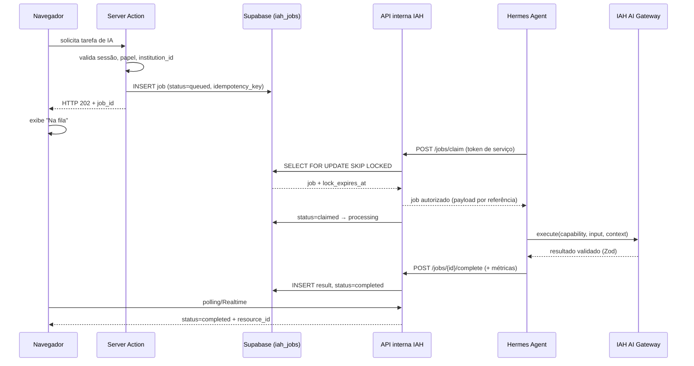
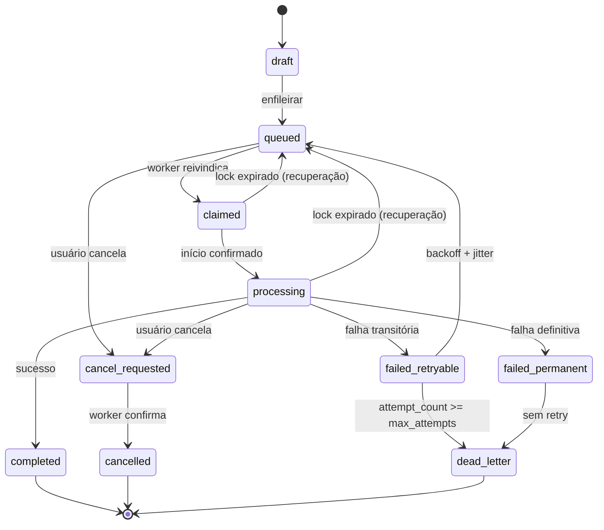

# Arquitetura Orientada a Eventos — IAH Educacional + Hermes Agent

> **Documento de arquitetura. Nenhum código funcional foi alterado.** Nenhuma migration foi criada, nenhuma dependência instalada, nenhum serviço externo executado, nenhum dado real de estudante utilizado. Todas as afirmações sobre o estado atual vêm de inspeção do repositório nesta auditoria — trechos e arquivos citados são verificáveis.
>
> Complementa `docs/PERSISTENCE.md` (persistência) e `docs/DECISIONS.md` (D-023, D-041). Não substitui nenhum deles.

---

## 1. Resumo executivo

O IAH Educacional é hoje uma aplicação **Next.js síncrona** sobre Supabase, sem nenhuma infraestrutura assíncrona: não existe tabela de jobs, fila, worker, webhook ou uso de Realtime. Toda a IA do produto passa por **um único arquivo** (`apresentacao-slides/actions.ts`), dentro de uma Server Action que mantém a requisição aberta por até 25 s.

Para as operações longas descritas (composição de missão, geração de material, síntese pedagógica, análises do MaestrIAH), esse desenho é inviável em serverless — não por opinião arquitetural, mas por limite de plataforma: uma Server Action na Vercel não sobrevive ao tempo dessas tarefas nem à saída do usuário da página.

A recomendação é **PostgreSQL/Supabase como fila durável (opção A)** para o MVP, com Hermes Agent como worker externo autenticado por API interna, e **polling com backoff** como notificação inicial. Não porque seja a solução mais sofisticada, mas porque é a única que não adiciona nenhuma peça de infraestrutura nova a um sistema que ainda não validou o básico — e porque a alternativa aparentemente óbvia (Supabase Realtime) está **bloqueada por uma restrição concreta do banco atual**, documentada na §11.4.

O caminho é incremental e reversível: nada do que já existe precisa ser reescrito. O Gateway, os repositórios e o contrato `LlmProvider` permanecem intactos.

---

## 2. Diagnóstico do estado atual

### 2.1 O que foi inspecionado

`CLAUDE.md`, `docs/DEPLOY.md`, 12 migrations, `package.json`, `next.config.ts`, e os 346 arquivos `.ts/.tsx` de `app/src` (incluindo os módulos de MentorIAH, DocentIAH e MaestrIAH).

### 2.2 Achados — medidos, não inferidos

| Item | Estado | Evidência |
|---|---|---|
| Tabelas de job/fila | **Não existem** | `grep "create table (job|task|queue|async)"` nas 12 migrations → 0 resultados |
| Supabase Realtime | **Nunca usado** | `.channel(` / `postgres_changes` / `subscribe(` em `app/src` → 0 ocorrências |
| Webhooks | **Não existem** | `webhook` em `app/src` → 0 ocorrências |
| Rotas HTTP | **2 apenas** | `/api/auth/[...nextauth]`, `/api/contato` — todo o resto é Server Action |
| Chamadas ao Gateway | **1 arquivo** | `professor/docente-iah/apresentacao-slides/actions.ts` é o único importador de `lib/ai/gateway` |
| Capabilities com prompt | **2** | `docentiah.improve_context` (v1–v3), `docentiah.slides` (v1) |
| Timeout | **Existe: 25.000 ms** | `llm-provider-factory.ts:24-27`, calibrado após gate real de 2026-07-24 |
| Retry | **Existe: 1 tentativa** | `resilient-llm-provider.ts:54-57`, só para `ProviderTransportError` |
| Circuit breaker | **Existe, em memória** | `circuit-breaker.ts:11` — 3 falhas consecutivas, janela de 5 min |
| Rate limiting | **Existe, parcial** | `preview-limits.ts` — 10/dia por professor + lock de 1 simultânea, aplicado a **1** capability |
| Auditoria de custo | **Tabela existe, subutilizada** | `generation_usage` (migration 0009) tem tokens e custo; só `apresentacao-slides` grava |
| MaestrIAH | **Não existe como módulo** | `src/modules/` não tem `maestriah`; há rotas em `(platform)/mantenedor` |
| RLS | **41 tabelas, 0 policies** | Deny-by-default por decisão D-041 |
| Deploy | **Vercel, push-to-deploy** | `docs/DEPLOY.md:11` — `main` → deploy automático |

### 2.3 Correção a uma auditoria anterior

Em auditoria anterior desta sessão eu afirmei que **"não existe CI/CD"**. Está errado e corrijo aqui: `docs/DEPLOY.md:11-15` documenta deploy contínuo Vercel↔GitHub, ativo e em uso.

O problema real é diferente e mais grave: **existe CD sem CI**. Todo push na `main` vai a produção sem gate de lint, tipos ou testes. Os 210 testes só rodam se alguém lembrar. Isso não é ausência de automação — é automação sem rede de proteção.

### 2.4 Por que o desenho atual não suporta operações longas

Três limites concretos, não hipotéticos:

1. **Serverless não mantém processo vivo.** A Vercel encerra a função ao fim da resposta HTTP. Não há onde uma tarefa de minutos continuar rodando.
2. **Estado em memória não sobrevive.** `circuit-breaker.ts:19` (`const circuits = new Map`) e `preview-limits.ts:48` (`const inFlightUsers = new Set`) são por processo. Com N instâncias, N estados independentes — ambos os arquivos já documentam essa limitação honestamente.
3. **A sessão do navegador é acoplada ao resultado.** Se o usuário fechar a aba durante uma Server Action, o trabalho é perdido sem registro.

---

## 3. Decisão arquitetural recomendada

### 3.1 Comparação das opções

| Critério | A. Postgres/Supabase | B. pgmq | C. Trigger.dev/Inngest/QStash | D. Redis/BullMQ/RabbitMQ | E. n8n/Make | F. Híbrido |
|---|---|---|---|---|---|---|
| Compat. Next.js/Vercel | Alta | Alta | Muito alta (nativa) | Média (exige worker próprio) | Média | Alta |
| Compat. Supabase | **Nativa** | Nativa (extensão) | Externa | Externa | Externa | Nativa + externa |
| Custo inicial | **US$ 0** (banco já pago) | US$ 0 | Free tier, cresce com volume | Serviço adicional | Assinatura | Baixo |
| Complexidade operacional | **Mínima** | Baixa | Baixa | **Alta** | Média | Média |
| Durabilidade | Alta (ACID) | Alta | Alta | Alta (com persistência) | **Baixa** | Alta |
| Retries | Manual (explícito) | Nativo | **Nativo** | Nativo | Limitado | Nativo |
| Concorrência | `FOR UPDATE SKIP LOCKED` | Nativa | Nativa | **Excelente** | Fraca | Boa |
| Dead-letter | Tabela própria | Nativo | **Nativo** | Nativo | Manual | Nativo |
| Observabilidade | SQL próprio | SQL | **Dashboard pronto** | Ferramenta externa | Dashboard | Mista |
| Isolamento institucional | **Nativo** (`institution_id` + RLS) | Nativo | Externo (exige cuidado) | Externo | Externo | Nativo |
| Integração Hermes | Simples (API interna) | Simples | Média (SDK) | Média | Simples | Simples |
| Adequação ao MVP | **Ótima** | Boa | Boa | Ruim (overkill) | Ruim | Média |
| Escala | Boa até ~centenas/min | Muito boa | Muito boa | **Excelente** | Ruim | Excelente |

### 3.2 Decisões

**MVP — opção A: PostgreSQL/Supabase como fila durável.**

Justificativa que importa: o projeto tem hoje **2 capabilities de IA reais** e **1 arquivo** chamando o Gateway. Introduzir Redis, RabbitMQ ou um serviço gerenciado de jobs seria adicionar uma dependência operacional permanente para um volume que o Postgres resolve com uma tabela e `FOR UPDATE SKIP LOCKED`. O isolamento por `institution_id` já é a disciplina do projeto (42 filtros `eq("institution_id")` medidos nos repositórios) — a fila herda isso de graça.

**Alvo para escala — opção F: híbrido A+C.**

Quando o volume justificar (gatilhos objetivos na §13.4), manter o Postgres como **fonte de verdade dos jobs** e adicionar um serviço gerenciado (Inngest ou Trigger.dev) como **camada de execução e agendamento**. A tabela continua sendo o registro durável e auditável; o serviço cuida de concorrência, backoff e dashboard. Migração incremental, sem trocar o modelo de dados.

**Não usar como núcleo da fila:**

- **n8n / Make.com** — vetado pela própria instrução, e com razão: não são fonte de verdade transacional. Podem ser adaptadores de borda (notificação, integração com Classroom), nunca o registro dos jobs.
- **Redis/BullMQ/RabbitMQ** — não pelo mérito técnico, que é alto, mas por custo operacional incompatível com o estágio atual.
- **Memória do processo** — já provado inviável na §2.4.

---

## 4. Arquitetura MVP

```
Navegador
   │  (1) Server Action: solicita tarefa
   ▼
Next.js / Server Action  ──────── valida sessão, papel, institution_id
   │                              (getWorkspaceContext — nunca confia no cliente)
   │  (2) INSERT em iah_jobs (status=queued)
   ▼
Supabase / PostgreSQL  ◄──────────────────────────────┐
   │                                                   │
   │  (3) HTTP 202 + job_id ──► navegador               │ (7) UPDATE status/result
   │                                                   │
   │                                    API interna do IAH (rotas /api/internal/jobs/*)
   │                                                   ▲
   │  (4) Hermes reivindica via API interna            │ autenticada por token de serviço
   ▼                                                   │
Hermes Agent (worker externo, fora do serverless) ─────┘
   │  (5) executa via IAH AI Gateway
   ▼
IAH AI Gateway → LlmProvider (DeepSeek / demonstrativo)
```

**Princípios que o MVP preserva:**

- O Hermes **nunca** acessa o Supabase diretamente. Toda leitura/escrita passa pela API interna do IAH, que aplica autorização e isolamento (§7.4).
- O Gateway continua sendo o único ponto de chamada de IA. Nada muda em `gateway.ts`.
- O `institution_id` sempre vem da sessão autenticada do produtor, nunca do payload.

---

## 5. Arquitetura-alvo (escala)

Mesma fonte de verdade, execução delegada:

```
Server Action ──► iah_jobs (Postgres, fonte de verdade)
                      │
                      ├──► Inngest/Trigger.dev (execução, backoff, agendamento)
                      │         │
                      │         └──► Hermes Agent (pool de workers)
                      │
                      └──► Supabase Realtime (notificação, após policies por tenant)
```

Diferenças em relação ao MVP: concorrência gerenciada, backoff nativo, dashboard de observabilidade pronto, agendamento de tarefas periódicas (análises do MaestrIAH), e notificação push em vez de polling.

---

## 6. Diagramas

### 6.1 Fluxo nominal — TRIGGER → ACTION → ESTADO → EVENTO → CONSUMIDOR → RETORNO

```
TRIGGER      Professor clica "Compor missão"
ACTION       Server Action valida sessão → deriva institution_id/user_id
             → checa idempotency_key → INSERT iah_jobs
ESTADO       queued
EVENTO       iah.job.requested (registrado em iah_job_events)
CONSUMIDOR   Hermes Agent chama POST /api/internal/jobs/claim
             → SELECT ... FOR UPDATE SKIP LOCKED → status=claimed → processing
             → executa via IAH AI Gateway
RETORNO      POST /api/internal/jobs/{id}/complete
             → grava resultado em iah_job_results → status=completed
             → interface detecta por polling/Realtime → usuário vê o resultado
```

### 6.2 Mermaid — visão geral



### 6.3 Mermaid — máquina de estados



### 6.4 Fluxos alternativos

**Erro** — falha no Gateway → Hermes chama `/fail` com código sanitizado → `failed_retryable` (transitória) ou `failed_permanent` (validação/autorização) → evento registrado.

**Retry** — `failed_retryable` + `attempt_count < max_attempts` → `scheduled_at = now() + backoff` → volta a `queued`. Backoff exponencial com jitter (§9.7).

**Cancelamento** — usuário solicita → `cancel_requested`. O worker verifica a flag entre etapas; ao detectar, aborta e confirma `cancelled`. Cancelamento **não** interrompe chamada de IA em andamento — apenas impede persistência do resultado e novas tentativas.

**Timeout** — `lock_expires_at < now()` sem heartbeat → varredura devolve o job a `queued` e incrementa `attempt_count`. Protege contra worker morto sem aviso (cenário real em serverless).

**Dead-letter** — esgotadas as tentativas ou falha permanente → cópia em `iah_job_dead_letters` com o último erro sanitizado. Nunca reprocessa automaticamente; exige ação humana.

---

## 7. Modelo de dados (conceitual — nenhuma migration criada)

### 7.1 `iah_jobs` — registro durável do trabalho

**Finalidade:** fonte única de verdade sobre o que foi pedido, por quem, em que estado.

| Campo | Tipo | Nota |
|---|---|---|
| `id` | text PK | Padrão do projeto é `text`, não `uuid` (ver §14.1) |
| `institution_id` | text NOT NULL FK → institutions | Isolamento |
| `requested_by_user_id` | text NOT NULL FK → users | Auditoria |
| `product` | text NOT NULL | `mentoriah` / `docentiah` / `maestriah` |
| `capability` | text NOT NULL | Ex.: `docentiah.compose_mission` |
| `entity_type` / `entity_id` | text | Alvo do trabalho |
| `status` | text NOT NULL | CHECK com os 10 estados da §9 |
| `priority` | integer NOT NULL default 100 | Menor = mais urgente |
| `payload` | jsonb NOT NULL | **Só referências e parâmetros** (§8.3) |
| `result_reference` | text | FK lógica → `iah_job_results` |
| `error_code` / `error_message` | text | Mensagem **sanitizada** |
| `attempt_count` / `max_attempts` | integer | Default 0 / 3 |
| `scheduled_at` | timestamptz NOT NULL default now() | Backoff |
| `started_at` / `completed_at` | timestamptz | |
| `created_at` / `updated_at` | timestamptz NOT NULL default now() | |
| `idempotency_key` | text NOT NULL | Deduplicação |
| `correlation_id` / `trace_id` | text | Rastreio ponta a ponta |
| `locked_by` / `lock_expires_at` | text / timestamptz | Reivindicação |
| `provider` / `model` | text | Preenchidos na conclusão |
| `estimated_cost` / `actual_cost` | numeric(10,4) | Mesma precisão de `generation_usage` |

**Constraints:** `unique (institution_id, idempotency_key)` — deduplicação por tenant, nunca global.
**Índices:** `(status, scheduled_at, priority)` para o claim; `(institution_id, created_at desc)` para listagem; `(correlation_id)` para rastreio; `(lock_expires_at) where status in ('claimed','processing')` para varredura de travados.
**Retenção:** payload operacional detalhado 30 dias; registro do job 90 dias após `completed`; `dead_letter` retido até resolução manual (política oficial, D-047 §8).

### 7.2 `iah_job_attempts`

Uma linha por tentativa: `job_id`, `attempt_number`, `started_at`, `finished_at`, `outcome`, `error_code`, `error_message`, `provider`, `model`, `input_tokens`, `output_tokens`, `estimated_cost`, `worker_id`.
`unique (job_id, attempt_number)`. Retenção 90 dias. Permite distinguir "falhou 3× por timeout" de "falhou 1× e o worker morreu 2×".

### 7.3 `iah_job_events`

Log append-only de transições: `job_id`, `sequence_number`, `event_type`, `from_status`, `to_status`, `actor_type` (`user`/`worker`/`system`), `actor_id`, `metadata` (jsonb, sem PII), `created_at`.
`unique (job_id, sequence_number)` — mesmo padrão já validado em `mentor_messages`. Trilha de auditoria: **nunca** sofre UPDATE ou DELETE.

### 7.4 `iah_job_results`

Separa resultado do controle — payloads grandes não inflam a tabela consultada a cada polling.
`id`, `job_id`, `institution_id`, `result_type`, `content` (jsonb) **ou** `storage_path`, `schema_version`, `size_bytes`, `created_at`.
Retenção seguindo o dado de origem. Resultados acima de ~100 KB vão para Storage, com o caminho referenciado aqui.

### 7.5 `iah_job_dead_letters`

`id`, `job_id`, `institution_id`, `capability`, `final_error_code`, `final_error_message` (sanitizada), `attempt_count`, `payload_snapshot` (jsonb, sem PII), `moved_at`, `reviewed_at`, `reviewed_by`, `resolution`.
Sem retenção automática — sai por ação humana.

### 7.6 Estratégia de RLS

Todas as cinco tabelas nascem com RLS habilitada, seguindo D-041 (deny-by-default). Acesso pelo servidor via service role.

**Exceção deliberada e necessária:** se Realtime for adotado (§11), `iah_jobs` precisará de uma policy `SELECT` por tenant amarrada ao usuário autenticado — seria a **primeira policy do projeto**. Isso é uma mudança de postura de segurança, não um detalhe de implementação, e exige decisão explícita (§14.2).

---

## 8. Contratos JSON

### 8.1 Criação de job — `iah.job.requested`

```json
{
  "event_version": "1.0",
  "event_type": "iah.job.requested",
  "job_id": "job-uuid",
  "institution_id": "inst-uuid",
  "requested_by": { "user_id": "user-uuid", "role": "teacher" },
  "product": "docentiah",
  "capability": "docentiah.compose_mission",
  "entity": { "type": "lesson_plan", "id": "lesson-uuid" },
  "input": { "reference_ids": ["ref-1"], "parameters": { "grade": "2EM" } },
  "idempotency_key": "sha256:...",
  "correlation_id": "corr-uuid",
  "requested_at": "2026-07-28T00:00:00Z"
}
```

**Obrigatórios:** `event_version`, `event_type`, `job_id`, `institution_id`, `requested_by.user_id`, `product`, `capability`, `idempotency_key`, `requested_at`.
**Opcionais:** `entity`, `input.parameters`, `correlation_id` (gerado se ausente), `priority`.

**Proibidos — rejeitar no schema, não apenas ignorar:**
- `service_role_key`, tokens, senhas, cookies de sessão
- prompt completo montado (o Gateway monta a partir da capability)
- conteúdo integral de arquivos (usar `reference_ids`)
- dados de outra instituição
- PII não anonimizada de estudante

**Limite de tamanho:** 32 KB. Acima disso, referência por ID — regra que segue o princípio já adotado em `data-anonymizer.ts`.
**Versionamento:** `event_version` semântico; consumidores devem rejeitar major desconhecido.
**Validação:** Zod, no mesmo padrão de `src/lib/ai/prompts/*/schema.ts`.

### 8.2 Conclusão — `iah.job.completed`

```json
{
  "event_version": "1.0",
  "event_type": "iah.job.completed",
  "job_id": "job-uuid",
  "status": "completed",
  "result": { "type": "reference", "resource_id": "result-uuid" },
  "metrics": {
    "duration_ms": 42000,
    "provider": "deepseek",
    "model": "deepseek-v4-flash",
    "input_tokens": 1200,
    "output_tokens": 3400,
    "estimated_cost": 0.0012
  },
  "completed_at": "2026-07-28T00:00:42Z"
}
```

O resultado é sempre **referência**, nunca conteúdo inline — mantém o payload pequeno e o dado sob controle de acesso do IAH.

### 8.3 Falha sanitizada — `iah.job.failed`

```json
{
  "event_version": "1.0",
  "event_type": "iah.job.failed",
  "job_id": "job-uuid",
  "status": "failed_retryable",
  "error": {
    "code": "provider_timeout",
    "message": "O provedor não respondeu dentro do tempo limite.",
    "retryable": true,
    "attempt": 2,
    "max_attempts": 3
  },
  "metrics": { "duration_ms": 25000, "provider": "deepseek" },
  "failed_at": "2026-07-28T00:00:25Z"
}
```

`message` é **sempre** texto controlado do catálogo de erros — nunca `error.message` cru do provedor, que pode conter fragmentos de prompt ou headers. O projeto já tem esse cuidado em `provider-audit-error-code.ts`.

---

## 9. Máquina de estados

### 9.1 Transições permitidas

| De | Para | Quem |
|---|---|---|
| `draft` | `queued` | Produtor (Server Action) |
| `queued` | `claimed` | Worker (via API interna) |
| `claimed` | `processing` | Worker |
| `processing` | `completed` | Worker |
| `processing` | `failed_retryable` / `failed_permanent` | Worker |
| `failed_retryable` | `queued` | Sistema (após backoff) |
| `failed_retryable` | `dead_letter` | Sistema (tentativas esgotadas) |
| `failed_permanent` | `dead_letter` | Sistema |
| `queued` / `processing` | `cancel_requested` | Usuário autorizado |
| `cancel_requested` | `cancelled` | Worker |
| `claimed` / `processing` | `queued` | Sistema (lock expirado) |

### 9.2 Transições proibidas

- Qualquer coisa → `draft` (estado inicial apenas)
- `completed` / `cancelled` / `dead_letter` → qualquer estado (terminais)
- `queued` → `processing` (deve passar por `claimed`, garantindo o lock)
- Worker alterando job de instituição diferente da autorizada no claim

### 9.3 Concorrência

`SELECT ... FOR UPDATE SKIP LOCKED LIMIT 1` na reivindicação. Dois workers simultâneos pegam jobs diferentes; nenhum bloqueia o outro. **Toda transição é condicional ao estado esperado** (`UPDATE ... WHERE id = $1 AND status = $2`) — se afetou 0 linhas, outro ator já mudou o estado e a operação aborta.

### 9.4 Expiração de lock

`lock_expires_at = now() + 5 min` na reivindicação, renovado por heartbeat a cada 60 s. Varredura periódica devolve a `queued` os jobs com lock expirado, incrementando `attempt_count`.

### 9.5 Recuperação de worker interrompido

É o cenário esperado, não excepcional — em serverless, processos morrem sem aviso. A expiração de lock cobre isso sem intervenção. O `attempt_count` incrementado impede loop infinito com worker cronicamente instável.

### 9.6 Limite de tentativas

`max_attempts` default 3, configurável por capability. Análises do MaestrIAH (caras, demoradas) podem usar 2; tarefas baratas, 5.

### 9.7 Backoff e jitter

`delay = min(base * 2^(attempt-1), max) * (0.5 + random()*0.5)` — base 30 s, teto 15 min. O jitter é obrigatório: sem ele, N jobs que falharam juntos (queda do provedor) voltam juntos e derrubam o provedor de novo. O mesmo problema já foi identificado no circuit breaker atual (`circuit-breaker.ts:31-38`, ausência de half-open).

### 9.8 Deduplicação

`idempotency_key` derivada de `(institution_id, capability, entity_id, hash(parâmetros normalizados))`. `unique (institution_id, idempotency_key)` faz o banco rejeitar duplicata. Ao violar, a API retorna o job existente com **HTTP 200** (não 202) — o cliente recebe o mesmo `job_id` e nada é reprocessado. Mesmo padrão já validado em `mentor_messages.append` (`database-repositories.ts:174`), que trata `23505` devolvendo a linha existente.

---

## 10. Contrato do Hermes Agent

### 10.1 Postura de segurança

**O Hermes nunca recebe acesso direto ao Supabase.** Sem service role key, sem connection string, sem cliente Supabase. Toda interação passa pela API interna do IAH, autenticada por token de serviço dedicado, com escopo por capability.

Razão: a service role ignora RLS por desenho do Postgres. Entregá-la a um worker externo elimina toda a barreira de isolamento multi-tenant de uma vez.

### 10.2 Ciclo de vida

| Etapa | Endpoint | Comportamento |
|---|---|---|
| Reivindicar | `POST /api/internal/jobs/claim` | `FOR UPDATE SKIP LOCKED`; devolve job + `lock_expires_at` + contexto autorizado |
| Heartbeat | `POST /api/internal/jobs/{id}/heartbeat` | Estende `lock_expires_at`; falha se o lock já foi perdido |
| Progresso | `POST /api/internal/jobs/{id}/progress` | Registra evento sem mudar status |
| Concluir | `POST /api/internal/jobs/{id}/complete` | Grava resultado + métricas; transição condicional |
| Falhar | `POST /api/internal/jobs/{id}/fail` | Código do catálogo + mensagem sanitizada |
| Cancelar | resposta do heartbeat | API sinaliza `cancel_requested`; worker aborta e confirma |

### 10.3 Contexto autorizado

O Hermes **não consulta o banco para montar contexto**. A API interna carrega e devolve, no claim, apenas o que a capability precisa — já filtrado por `institution_id` e já anonimizado por `data-anonymizer.ts`. O worker recebe um pacote fechado; não tem como pedir mais.

### 10.4 Isolamento entre instituições

Três camadas independentes:
1. O claim devolve `institution_id`; toda escrita subsequente é validada contra ele.
2. A API interna deriva o tenant do job, nunca de parâmetro do worker.
3. Um job só aceita escrita do `locked_by` que o reivindicou e com lock válido.

### 10.5 Execução duplicada

Impedida em três pontos: `SKIP LOCKED` (dois workers não pegam o mesmo job), transição condicional (`WHERE status = $esperado`), e `idempotency_key` (a mesma solicitação não vira dois jobs).

---

## 11. Retorno, notificação e segurança

### 11.1 Callback: webhook (A) vs. API interna (B)

**Recomendado: B — API interna do IAH.**

| Aspecto | A. Webhook | B. API interna |
|---|---|---|
| Superfície pública | Nova rota exposta | Nenhuma nova rota pública |
| Autenticação | Assinatura HMAC + anti-replay | Token de serviço (mesma da claim) |
| Complexidade | Alta (rotação de segredo, janela de replay) | Baixa |
| Validação de resultado | No receptor | No mesmo lugar que já valida |

O webhook adiciona uma superfície pública e um conjunto inteiro de controles (assinatura, nonce, janela temporal) para resolver um problema que a API interna não cria. Como o Hermes já autentica para reivindicar, reusar o mesmo canal é mais simples e mais seguro.

### 11.2 Controles de segurança

- **Produtor:** sessão Auth.js; `institution_id` e `user_id` sempre de `getWorkspaceContext()`, jamais do cliente (padrão já em `mentor-actions.ts:36,45`).
- **Hermes:** token de serviço rotacionável, escopo por capability, expiração curta.
- **Idempotência:** §9.8.
- **LGPD:** payload por referência; anonimização antes de qualquer envio externo; `iah_job_events.metadata` sem PII; exclusão em cascata ao remover o titular.
- **Prompt injection:** o Gateway já marca fontes externas como `untrusted="true"` com instrução explícita de ignorar comandos embutidos (`AI_PROVIDER_GATEWAY.md`, §2). O job não altera isso.
- **Respostas inválidas do modelo:** validação Zod + 1 reparo, já implementada em `gateway.ts`.
- **Limites de consumo:** hoje `preview-limits.ts` é em memória e cobre 1 capability. Na fila, o limite passa a ser **consulta ao banco** — o que corrige de quebra o TOCTOU identificado em auditoria anterior (`apresentacao-slides/actions.ts:199-207`).

### 11.3 Comparação de notificação

| Mecanismo | Prós | Contras | MVP? |
|---|---|---|---|
| Supabase Realtime | Push nativo, sem polling | **Exige policy RLS por tenant** (§11.4) | Não |
| SSE | Simples, unidirecional | Conexão longa — ruim em serverless | Não |
| WebSockets | Bidirecional | Infra própria, overkill | Não |
| **Polling com backoff** | Zero infra, funciona hoje | Latência de segundos | **Sim** |
| E-mail/push | Bom para tarefas longas | Não serve para feedback imediato | Complementar |

### 11.4 Por que não Realtime no MVP — restrição medida

Verifiquei nas 12 migrations: **41 tabelas com RLS habilitada e 0 policies**. Isso é deliberado (D-041, deny-by-default: só o servidor acessa, via service role).

A consequência para Realtime é decisiva: o Realtime do Supabase respeita a RLS do papel do cliente (`authenticated`). Com zero policies, um cliente autenticado **não recebe nenhum evento** — o canal conecta e fica mudo. Não é um detalhe de configuração; é a postura de segurança atual funcionando como projetado.

Adotar Realtime exigiria criar a primeira policy do projeto e expor `iah_jobs` a leitura direta do navegador. É uma decisão de segurança legítima, mas que **contraria D-041** e precisa de aprovação explícita (§14.2) — não deve ser tomada de dentro de uma tarefa de arquitetura de fila.

**Polling recomendado:** 2 s nos primeiros 30 s → 5 s até 2 min → 15 s depois; para ao sair da aba, retoma ao voltar.

### 11.5 Estados na interface

`Na fila` (202 recebido) → `Processando` → `Concluído` (com acesso ao resultado) ou `Erro` (com "Tentar novamente" quando `retryable`). O usuário pode sair da página a qualquer momento; ao voltar, o estado é recuperado por `job_id`.

---

## 12. Observabilidade

### 12.1 Métricas mínimas

Derivadas de SQL sobre as tabelas de job — sem ferramenta externa no MVP:

| Métrica | Origem |
|---|---|
| Jobs criados (total, por produto, por capability) | `iah_jobs` |
| Tempo na fila | `started_at - created_at` |
| Tempo de execução | `completed_at - started_at` |
| Taxa de sucesso / retry | `iah_job_attempts` |
| Jobs em dead-letter | `iah_job_dead_letters` |
| Custo por job / por instituição / por modelo | `actual_cost` agregado |
| Erros por capability | `error_code` agrupado |
| Jobs travados | `lock_expires_at < now()` |
| Profundidade da fila | `count(*) where status='queued'` |

### 12.2 Correlation ID

Um `correlation_id` gerado na Server Action e propagado por: interface → API → `iah_jobs` → Hermes → Gateway → `generation_usage` → logs. Permite reconstruir uma solicitação inteira a partir de um único identificador.

### 12.3 Alerta que falta hoje

O fallback do circuit breaker é **silencioso por desenho** (`resilient-llm-provider.ts:43-45`): quando o provedor real cai, o usuário recebe conteúdo do motor demonstrativo e ninguém é avisado. Com `iah_jobs.provider` registrado por job, isso vira uma métrica trivial (`provider='demo'` acima de X% = alerta) — ganho colateral relevante da fila.

---

## 13. Classificação das capabilities

### 13.1 MentorIAH

| Capability | Classificação | Justificativa |
|---|---|---|
| Conversa socrática | **Síncrona** | Latência é parte da experiência; validado em produção nesta sessão (sessão + 4 mensagens persistidas) |
| Síntese de sessão | **Assíncrona** | Longa, sem usuário esperando |
| Análise de tentativa | **Assíncrona** | Agregação pesada |
| Sinalização de intervenção | **Híbrida** | Detecção síncrona; relatório assíncrono |

### 13.2 DocentIAH

| Capability | Classificação | Estado hoje |
|---|---|---|
| `improve_context` | **Híbrida** | Implementada, síncrona (25 s) — mantém |
| `generate_slides` | **Assíncrona** | Implementada, síncrona — migrar |
| `compose_mission` | **Assíncrona** | Não existe |
| `generate_assessment` | **Assíncrona** | Não existe (botão desabilitado) |
| `adapt_material` | **Assíncrona** | Não existe (card decorativo) |
| `generate_lesson_plan` | **Assíncrona** | Não existe |
| Criação de intervenção | **Assíncrona** | Não existe |

### 13.3 MaestrIAH

**Nenhuma capability existe** — não há módulo `maestriah` em `src/modules/`. Todas seriam assíncronas por natureza (relatórios extensos, agregações, sínteses institucionais, análises periódicas agendadas).

### 13.4 Gatilhos para migrar à arquitetura-alvo

Migrar quando **qualquer um** ocorrer: >500 jobs/dia sustentados; p95 de tempo na fila >60 s; >3 instituições ativas com uso concorrente; necessidade de agendamento periódico (MaestrIAH).

---

## 14. Plano de implementação — 14 micro missões

| # | Objetivo | Arquivos prováveis | Testes | Critério de aceite | Riscos | Depende de |
|---|---|---|---|---|---|---|
| 1 | ADR da decisão | `docs/DECISIONS.md` | — | ADR aprovado pelo Founder | Decidir sem alinhamento | — |
| 2 | Contrato de eventos (Zod) | `src/lib/jobs/contracts/*.ts` | Schema aceita válido, rejeita proibido | Campos proibidos rejeitados | Contrato prematuro | 1 |
| 3 | Máquina de estados pura | `src/lib/jobs/state-machine.ts` | Transições válidas/inválidas | 100% das transições cobertas | — | 2 |
| 4 | Migration das 5 tabelas | `supabase/migrations/*_iah_jobs.sql` | Aplicar em dev, validar constraints | Tabelas + índices + RLS | **GRANT** (ver §15) | 3 |
| 5 | Repositório de jobs | `src/modules/jobs/**` | Claim concorrente, idempotência | 2 workers não pegam o mesmo job | Race no claim | 4 |
| 6 | Server Action produtora | `src/modules/jobs/infrastructure/job-actions.ts` | Cria job, retorna 202, dedupe | 202 + `job_id`; duplicata → 200 | `institution_id` do cliente | 5 |
| 7 | Worker determinístico | `src/lib/jobs/demo-worker.ts` | Ciclo completo sem IA | Job vai a `completed` sem Gateway | — | 6 |
| 8 | API interna + Hermes | `src/app/api/internal/jobs/**` | Auth, escopo, isolamento | Token inválido → 401; tenant errado → 403 | **Vazamento entre tenants** | 7 |
| 9 | Retry, backoff, dead-letter | `src/lib/jobs/retry-policy.ts` | Backoff com jitter, DLQ | 3 falhas → dead-letter | Tempestade de retry | 8 |
| 10 | Polling + estados na UI | `src/components/jobs/**` | Estados, retomada | Usuário sai e volta, vê resultado | — | 9 |
| 11 | Primeiro fluxo real: `compose_mission` | `prompts/docentiah/compose-mission/**` | Ponta a ponta | Missão gerada e persistida | Qualidade pedagógica | 10 |
| 12 | Observabilidade | `docs/OBSERVABILITY.md` + SQL | Métricas conferem | 9 métricas da §12.1 | — | 11 |
| 13 | Hardening (limites, custo, abuso) | `src/lib/jobs/quota.ts` | Limite por instituição | Teto respeitado sob concorrência | TOCTOU de novo | 12 |
| 14 | Expansão MentorIAH + MaestrIAH | vários | Por capability | Síntese assíncrona funcionando | Escopo | 13 |

**Pré-requisito fora da lista:** CI com gate de lint/tsc/build/test antes do deploy (§2.3). Barato, e protege as 14 missões.

---

## 15. Riscos e decisões pendentes

### 15.1 Riscos críticos

1. **API interna é nova superfície de ataque.** Hoje o projeto tem 2 rotas HTTP. A missão 8 adiciona endpoints que manipulam jobs de qualquer instituição. Um erro de autorização vaza dados entre escolas. Mitigação: token de serviço com escopo, tenant sempre derivado do job, teste automatizado de isolamento.
2. **GRANT em tabelas novas.** As tabelas criadas após a migration 0007 dependem de `ALTER DEFAULT PRIVILEGES FOR ROLE postgres`. Funcionou nas migrations aplicadas nesta sessão, mas é uma dependência frágil e não declarada. A missão 4 deve verificar explicitamente o acesso de `service_role` logo após aplicar.
3. **CD sem CI.** Push na `main` vai a produção sem gate de teste. Introduzir 5 tabelas e uma API interna nesse regime amplifica o risco de cada commit.

### 15.2 Riscos altos

4. **Realtime exigiria a primeira policy RLS do projeto**, contrariando D-041 (§11.4).
5. **Limites de consumo em memória** (`preview-limits.ts`) são ineficazes em serverless multi-instância — o próprio arquivo admite ("melhor esforço").
6. **Circuit breaker sem half-open** (`circuit-breaker.ts:31-38`): pico de tentativas simultâneas ao expirar a janela.
7. **Custo não observável por instituição** hoje: `generation_usage` só é gravada por 1 capability.
8. **Sessões do MentorIAH nunca são encerradas** — não há método `complete` no repositório. Uma síntese assíncrona "ao encerrar" não teria gatilho.

### 15.3 Decisões tomadas pelo Founder (D-047, 28/07/2026)

Este bloco listava decisões pendentes. **Todas foram decididas** e estão formalizadas em `docs/DECISIONS.md` § D-047:

1. ✅ **Fila em Postgres** como fonte de verdade do MVP — aceita mais código próprio em troca de zero infra nova.
2. ✅ **Manter polling e preservar D-041** — Realtime fica como evolução futura, condicionada à criação de políticas RLS específicas e seguras para os jobs. Não é recusa permanente.
3. ✅ **Hermes como worker externo**, sem `service_role`, sem connection string, sem SQL arbitrário, comunicando-se apenas pela API interna.
4. ✅ **Política de retenção** — payload operacional 30 dias; tentativas, métricas e erros sanitizados 90 dias; resultado pedagógico definitivo referenciado pelas tabelas do produto; prompts completos e respostas intermediárias não retidos.
5. ✅ **DocentIAH primeiro** — `docentiah.compose_mission` é o primeiro fluxo assíncrono; conversa socrática do MentorIAH permanece síncrona.
6. ✅ **CI é Etapa Zero**, obrigatória antes das 14 micro missões, com bloqueio de integração em caso de falha.
7. ✅ **Privilégios SQL declarados explicitamente** em toda migration nova, sem depender exclusivamente de `ALTER DEFAULT PRIVILEGES`.

Permanecem em aberto apenas questões de implementação, a resolver dentro das micro missões correspondentes: infraestrutura concreta de execução do worker (VM, container ou runner), limiar de alerta para fallback silencioso, e gatilho de encerramento de sessão do MentorIAH (§15.2, item 8).

### 15.4 Critérios para aprovação do piloto

O piloto só é aprovado com **todos** satisfeitos:

- 100 jobs consecutivos sem perda, sem duplicata, sem job travado
- p95 do tempo na fila < 30 s com 3 workers
- Teste de isolamento entre tenants passando em CI
- Dead-letter funcional: 3 falhas → DLQ, sem retry infinito
- Cancelamento efetivo em < 5 s
- Recuperação de worker morto validada (kill -9 durante `processing`)
- Custo por job registrado em 100% dos jobs concluídos
- Nenhum dado de estudante em `payload`, `metadata` ou logs
- `correlation_id` rastreável ponta a ponta
- Rollback testado: desligar a fila e voltar ao síncrono sem perda

---

## 16. O que este documento não decide

- Não substitui o IAH AI Gateway; a fila o **envolve**, não o troca.
- Não torna o Hermes fonte de verdade — o Postgres é.
- Não propõe n8n/Make como núcleo (vetado, e corretamente).
- Não cria migration, código ou serviço.
- Não usa dados reais de estudantes.
- Não resolve as pendências das §15.2 — apenas as registra com evidência.
